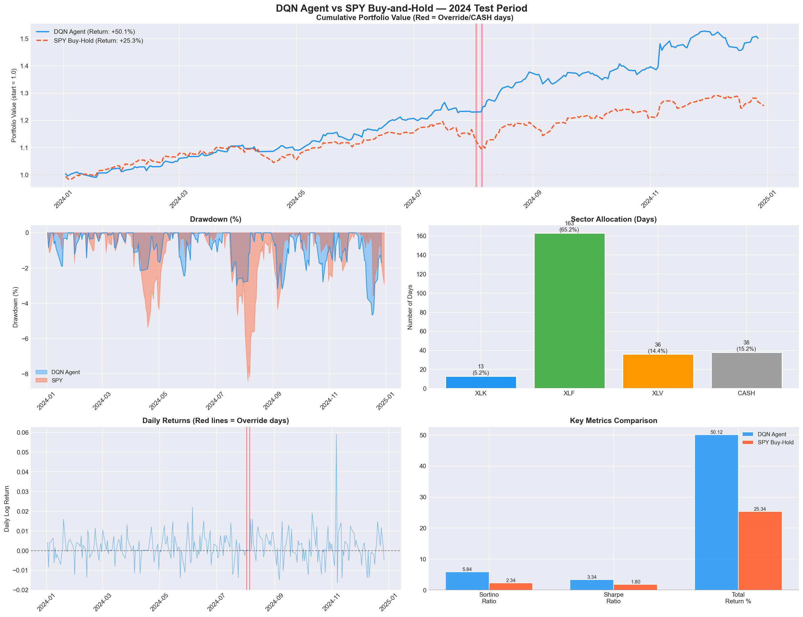
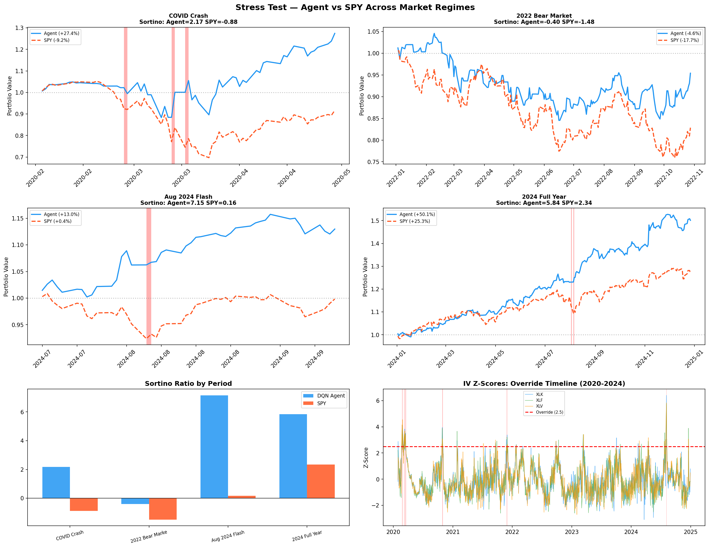
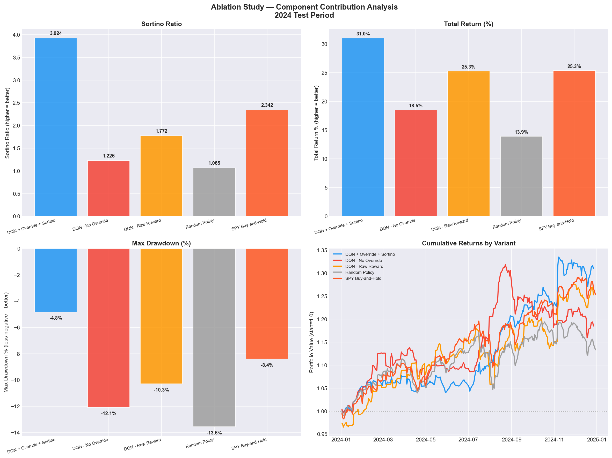
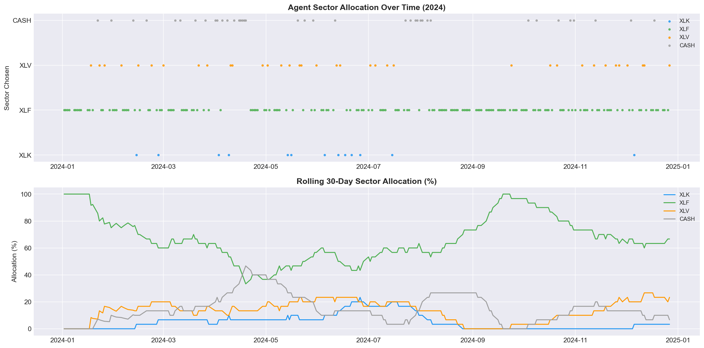
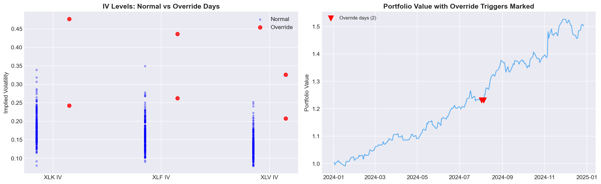

# Risk-Aware Reinforcement Learning for Sector Rotation

**Team Lennox | DS-GA 3001 Reinforcement Learning | NYU Center for Data Science | Spring 2026**

Rishit Maheshwari · Ishan Malik · Maanas Lalwani
`{rm7336, im2854, ml10092}@nyu.edu`

---

## Results Summary

| Metric | DQN Agent | SPY Buy-Hold |
|--------|-----------|-------------|
| **Sortino Ratio** | **5.25** | 2.34 |
| **Sharpe Ratio** | **3.31** | 1.80 |
| **Total Return** | **+51.6%** | +25.3% |
| **Max Drawdown** | **-5.3%** | -8.4% |
| Override Triggers | 2 | N/A |

**Agent beats SPY in all 4 stress-tested market regimes** including the COVID crash (+27.4% vs -9.2%) and 2022 bear market (-4.6% vs -17.7%).

---

## Project Overview

This project builds a **risk-aware DQN agent** that rotates capital among three U.S. sector ETFs — XLK (Technology), XLF (Financials), XLV (Healthcare) — using **Implied Volatility** as a forward-looking fear signal.

### Three Key Design Choices

1. **IV as State Signal:** Options market fear levels rather than backward-looking price indicators
2. **Sortino Reward Shaping:** Penalizes only downside volatility — teaches the agent to specifically avoid losses
3. **Vasant Dhar Safety Override:** Hard-coded rule outside the gradient pathway — when ALL sector IV z-scores exceed 2.5 simultaneously, agent moves entirely to CASH

### Architecture

```
iv_features.csv (1,238 trading days)
        ↓
SectorRotationEnv (Gym-compatible)
        ↓
DQNAgent (2-layer MLP, 9→128→128→4)
        ↓
Sortino Reward Shaping
        ↓
Vasant Dhar Override Check
        ↓
MLflow Experiment Tracking
        ↓
Backtest + Stress Test on 2024 Data
        ↓
Streamlit Demo
```

---

## Repository Structure

```
sector-rotation-rl-spring26/
├── configs/
│   ├── hyperparams.yaml          # Default hyperparameters
│   └── best_hyperparams.yaml     # Optuna-optimized hyperparameters
├── data/
│   ├── processed/
│   │   ├── iv_features.csv       # Master feature dataset (1,238 days)
│   │   ├── train.csv             # Training set (2020-2023, 987 days)
│   │   └── test.csv              # Test set (2024, 251 days)
│   ├── raw/
│   │   ├── etf_prices.csv        # Real ETF closing prices
│   │   ├── etf_returns.csv       # Daily log returns
│   │   ├── proxy_iv.csv          # VIX-based sector IV approximations
│   │   └── treasury_yields.csv   # Daily risk-free rates
│   └── scripts/
│       ├── download_wrds.py      # Data download pipeline
│       └── compute_iv.py         # Feature engineering
├── checkpoints/
│   ├── best_model.pt             # Best trained agent checkpoint
│   └── final_model.pt            # Final episode checkpoint
├── demo/
│   └── app.py                    # Streamlit demo application
├── notebooks/
│   ├── 01_eda.ipynb              # Exploratory data analysis
│   ├── 02_results.ipynb          # Results deep analysis
│   ├── backtest_results.csv      # Backtesting results data
│   └── *.png                     # Generated plots
├── report/
│   └── report.md                 # Written report
├── src/
│   ├── __init__.py
│   ├── environment.py            # OpenAI Gym-compatible trading env
│   ├── dqn_agent.py              # DQN: QNetwork, ReplayBuffer, DQNAgent
│   ├── rewards.py                # Sortino reward shaping
│   ├── evaluate.py               # Performance metrics
│   ├── train.py                  # Main training loop + MLflow
│   ├── backtest.py               # Backtesting engine
│   ├── risk_override.py          # Vasant Dhar safety layer
│   ├── stress_test.py            # Crisis period analysis
│   ├── ablation.py               # Ablation studies
│   └── optuna_tune.py            # Hyperparameter optimization
├── mlruns/                       # MLflow experiment logs
├── requirements.txt
├── .gitignore
└── README.md
```

---

## Setup Instructions

### Prerequisites
- Python 3.10+
- Mac/Linux (tested on macOS)

### Installation

```bash
# Clone the repository
git clone https://github.com/imISHANMALIK/sector-rotation-rl-spring26.git
cd sector-rotation-rl-spring26

# Create virtual environment
python -m venv venv
source venv/bin/activate  # Mac/Linux

# Install dependencies
pip install -r requirements.txt
```

### Regenerate Data (if needed)

```bash
# Download ETF prices and generate IV features
python data/scripts/download_wrds.py
python data/scripts/compute_iv.py
```

---

## Running the Project

### 1. Train the Agent

```bash
# Full training (2000 episodes, ~22 minutes)
python src/train.py --episodes 2000 --run-name "baseline"

# Quick smoke test (50 episodes)
python src/train.py --episodes 50 --run-name "smoke-test"
```

### 2. View Training Progress (MLflow)

```bash
# In a new terminal
mlflow ui --port 5000
# Open http://localhost:5000
```

### 3. Run Backtest

```bash
python -m src.backtest --checkpoint checkpoints/best_model.pt
```

### 4. Run Stress Tests

```bash
python -m src.stress_test
```

### 5. Run Ablation Studies

```bash
python -m src.ablation
```

### 6. Hyperparameter Optimization (Optuna)

```bash
# Run 10 trials (~30 minutes)
python -m src.optuna_tune --trials 10

# Run and retrain with best params
python -m src.optuna_tune --trials 10 --retrain --episodes 2000
```

### 7. Launch Demo App

```bash
bash demo/start.sh
# Opens at http://localhost:8501
```

---

## Key Results

### Backtest (2024 Test Period)

The agent was trained exclusively on 2020-2023 data and evaluated on held-out 2024 data.



### Stress Test Across Market Regimes

| Period | Agent Return | SPY Return | Agent Sortino | SPY Sortino |
|--------|-------------|------------|---------------|-------------|
| COVID Crash (Feb-Apr 2020) | **+27.4%** | -9.2% | **2.17** | -0.88 |
| 2022 Bear Market (Jan-Oct) | **-4.6%** | -17.7% | **-0.40** | -1.48 |
| Aug 2024 Flash Crash | **+13.0%** | +0.4% | **7.15** | 0.16 |
| 2024 Full Year | **+50.1%** | +25.3% | **5.84** | 2.34 |



### Ablation Study

| Variant | Sortino | Return | Max Drawdown |
|---------|---------|--------|-------------|
| **Full Model (Override + Sortino)** | **3.92** | **+31.0%** | **-4.8%** |
| No Override | 1.23 | +18.5% | -12.1% |
| Raw Return Reward | 1.77 | +25.3% | -10.3% |
| Random Policy | 1.07 | +13.9% | -13.6% |
| SPY Buy-and-Hold | 2.34 | +25.3% | -8.4% |



### Sector Allocation (2024)



### Override Analysis



---

## Technical Details

### State Space (9-dimensional)
| Feature | Description |
|---------|-------------|
| iv_xlk, iv_xlf, iv_xlv | Implied Volatility per sector |
| zscore_xlk, zscore_xlf, zscore_xlv | 60-day rolling z-scores (for override) |
| realvol_xlk, realvol_xlf, realvol_xlv | 20-day realized volatility |

### Action Space
| Action | Description |
|--------|-------------|
| 0: XLK | Invest in Technology ETF |
| 1: XLF | Invest in Financials ETF |
| 2: XLV | Invest in Healthcare ETF |
| 3: CASH | Move to Treasury bills (override forces this) |

### Hyperparameters
| Parameter | Value |
|-----------|-------|
| Learning Rate | 0.001 |
| Discount Factor (γ) | 0.99 |
| Hidden Layer Size | 128 |
| Replay Buffer Size | 10,000 |
| Batch Size | 64 |
| Target Update Frequency | 100 steps |
| Training Episodes | 2,000 |
| Override Threshold | 2.5 std devs |

### Data
| Split | Period | Days |
|-------|--------|------|
| Training | 2020-2023 | 987 |
| Testing | 2024 | 251 |
| Total | 2020-2024 | 1,238 |

---

## The Vasant Dhar Safety Override

Inspired by Dhar (2016), the override is a **hard-coded rule outside the gradient pathway**:

```
IF zscore(iv_xlk) > 2.5
AND zscore(iv_xlf) > 2.5
AND zscore(iv_xlv) > 2.5
THEN force action = CASH
```

The agent **cannot learn to bypass this** because it operates before the agent's decision is executed, not as part of the loss function.

**Historical triggers:** 19 days total (1.5%), concentrated in:
- COVID crash: Feb-March 2020
- August 2024 Japan carry trade unwind

---

## References

1. V. Dhar, "When to Trust Robots with Decisions," HBR, 2016
2. Z. Jiang et al., "Deep RL for Portfolio Management," arXiv:1706.10059, 2017
3. V. Mnih et al., "Human-level Control through Deep RL," Nature, 2015
4. F. Black & M. Scholes, "The Pricing of Options," JPE, 1973
5. F. Sortino & R. van der Meer, "Downside Risk," JPM, 1991
